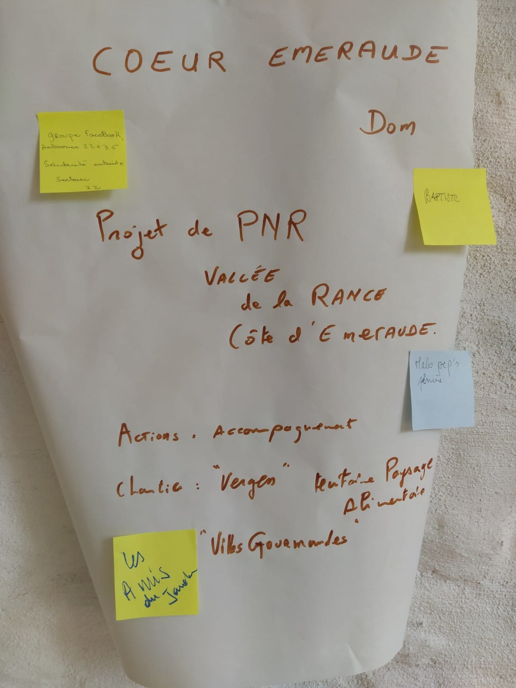

Compte-rendu de la journée de rencontre entre associations travaillant en lien avec l'alimentation, organisée le 27 juin 2020 par les vigiliantes.

<!--more-->

Personnes présentes:

- Béatrice - [Coeur Emeraude](http://coeur.asso.fr/)
- Juliette - [vigiliantes](https://www.vigiliantes.fr/) / [Extinction Rebellion Dinan Saint Malo](https://www.facebook.com/Extinction-Rebellion-Dinan-Saint-Malo-104136187669855)
- Linda - [vigiliantes](https://www.vigiliantes.fr/)
- Marie-Hélène Guitton - [Amis du Jardin](https://lesamisdujardin.bzh/), Dinan
- Tiphaine - [Amis du Jardin](https://lesamisdujardin.bzh/), Dinan
- Nawal - [vigiliantes](https://www.vigiliantes.fr/)
- Mickaël Chemin (Bio Coop St Malo) - Malo Pep's Pinière
- Carole Lebechec - Malo Pep's Pinière
- Bérénice - future éleveuse
- Camille - [Bretagne Vivante](https://www.bretagne-vivante.org/)
- Christine Revel - Asso [Vers le Jardin](https://www.vertlejardin.fr/spip.php?article3313), Pluduno
- Nicolas Choyeau - [Entrez-là Café](https://www.facebook.com/Treslavie/), Trélat, Taden
- Ludwig - Amap Ploubalay + conseiller municipal Ploubalay
- Stéphanie - [Groupement des Abriculteurs Biologiques (GAB) 22](https://www.agrobio-bretagne.org/gab-22/) + [maraîchère](http://www.lafermekabocha.bzh/)
- Joseph - [Petits Jardins des Ecoliers](https://petit-jardin-ecolier.org) et Secours Populaire
- Stella Corbes - [Cantons autonomes et solidaires 22](https://www.facebook.com/groups/269308000736178/)
- Yoann Foulques - Groupe entraide et solidarité 22
- Anna - [Cantons autonomes et solidaires 22](https://www.facebook.com/groups/269308000736178/)
- Jocelyn - [Cantons autonomes et solidaires 22](https://www.facebook.com/groups/269308000736178/)
- David Fargeau - [le Chant des Champs](http://lechantdeschamps.fr/)
- Mickaël Pépin - [Jardin des Hérissons](https://jardindesherissons.wixsite.com)
- Dominique - [Coeur Emeraude](http://coeur.asso.fr/)
- Laëtitia - [vigiliantes](https://www.vigiliantes.fr/)
- Claire - [vigiliantes](https://www.vigiliantes.fr/)
- Baptiste Bahuaud - maraîcher Lanvallay
- Christelle - [vigiliantes](https://www.vigiliantes.fr/)
- Rémi - [Ferme de la Raudais](http://fermedelaraudais.fr/)
- Mathilde - [vigiliantes](https://www.vigiliantes.fr/) + mairie Lanvallay

## Le programme 

## Se connaître 

### Affiches de présentation des structures

Exposition avec post-it :
- bleu : mêmes activités
- jaune : ce chantier m'intéresse

#### AMAP Ploubalay

#### Les amis du Jardin

#### Baptiste Bahuaud

#### Bretagne Vivante

#### Les champs comestibles

#### Le chant des Champs

#### Coeur Emeraude

#### Canton Solidaire et Autonome 22-35

#### Dinan agglomération (excusé)

#### Entrez-là Café

#### Extinction Rebellion Dinan

#### La Ferme Kabocha

#### Le jardin des Hérissons

#### Malo Peps Pinière

#### Le Petit Jardin des Ecoliers

#### Vers le Jardin

#### Les Vigiliantes

### Plénière matin

- Yoann Groupe entraide et solidarité 22 : **fusion avec Canton Solidaire et Autonome 22-35**. On a besoin de savoir s'organiser, d'aide pour bien organiser notre groupe. Comment faire pour bien se faire connaître ?

- Anna, même groupe : L'association va bientôt être créée, une vidéo va être publiée pour expliquer le groupe. Maintenant, on cherche à intégrer aussi les personnes handicapées (je suis membre du café solidaire de Dinan)

- Stella, CSA 22-35 : on va produire des **vidéos sur la production de produits ménagers bio et le recyclage de cartons**

- Béatrice - Coeur Emeraude : organisation en mars du **forum énergie positive**. A l'origine, c'était un forum où on apprend à réparer une fuite, faire des économies d'énergie... Aujourd'hui, c'est 20 structures sur des thématiques croisées développement durable. Votre structure aurait toute sa place là-bas.

- Béatrice - Coeur Emeraude : je trouve le projet de St Malo intéressant, car il n'y a pas encore de PAT sur l'agglo de St Malo et là ce sont des citoyens qui prennent le relais.

- Mickaël - Malo Pep's Pinière : les 2/3 du territoire sont à vocation agricole (il y a 15/ans : 3/4). Les 2/3 de ces territoires sont pour les choux-fleurs, + de la moitié en export pour l'Europe du nord. Dépendance totale des malouins à d'autres territoires et d'autres pays pour avoir accès à une alimentation variée. Ici aussi, + de 50% des exploitants ont + de 50 ans. On fait le même constat avec Terre de Liens mais ils ne sont que 2 salariés, ils ne peuvent pas tout faire donc des asso locales doivent prendre le relais.
**CSA de Combourg**, l'an prochain : 24 porteurs de projets, 23 en bio, 17 en maraîchage. Tous les projets n'aboutiront pas évidemment. Mais sur St Malo, il n'y a pas de terres. Avec le réseau régional Cohérence, on cherche à **faire le lien entre la sortie de l'école et l'installation définitive, sous forme de coopérative**. Le porteur de projet sera pas propriétaire mais pourra continuer à travailler sur les terres pendant 2, 3, 5 ans. Dans l'idée de créer une dynamique vertueuse.
Au niveau national, réseau d'espace test agricole. On aimerait 4 à 6 maraîchers à venir dans notre pépinière et qu'ils s'installent ensuite sur le territoire. **1 hectare par porteur de projet, donc on cherche 4 à 6 ha vers St Malo.**

Béatrice - Coeur Emeraude : ce qui est intéressant c'est la complémentarité des ressources.
**Côté Dinan : production animale, côté St Malo : production légumière.**
Intéressant d'aller chercher les jeunes qui sortent d'écoles. Je me souviens du témoigage d'un jeune qui sortait du lycée agricole de Caulnes qui disait qu'une douzaine de ses camarades partait sur du bio

Mickael : Aujourd'hui **on a déjà 2 hectares à Miniac qui attend qqn pour des fruits et légumes en bio, 1 hectare à Bouzac**

Stéphanie - GAB 22 : moi je suis **plus inquiète sur les reprises d'élevage**. En **maraicher au contraire, ça fleurit à gogo et il va falloir qu'on se coordonne pour pas se marcher sur les pieds**. Alors que sur l'élevage, là il n'y a pas grand chose. Il y a des conversions, mais les reprises, ça coûte trop cher. 

Joseph - Petits Jardins des Ecoliers et Secours Populaire : Aujourd'hui, les fermes à la vente font 40-50 hectares, mais les porteurs de projet cherchent moins.

Béatrice - Coeur Emeraude : mais il faut aussi que les cédants soient d'accord. Il y a une grosse pression des fermes à côté qui font de l'épandage, de la méthanisation... 

Commission départemantale d'orientation de l'agriculture, où siègent aussi la confédération paysanne, etc. On peut appuyer des projets.

Petit jardin des écoliers : sur quévert, on était 12 personnes au champs sur un jardin partagé (on était 3 l'an passé). Le nombre a explosé, et il y a notamment 3 maraîchers qui cherchent à se faire la main. Ils cherchent des terres.

**Sur Corseul, Quévert, Nord Dinan : + de 100ha sont en train d'être cédés aujourd'hui**. Comment on fait pour en récupérer un peu ?

Laetitia - vigiliantes : faut **encourager les élus à faire de la mise en réserve** pour avoir le temps de s'organiser, récupérer les grosses fermes à plusieurs. On a commencé à récolter les infos sur les porteurs de projet.

Joseph - Petits Jardins des Ecoliers et Secours Populaire : il faudrait un **espace test** et un **magasin de producteurs** sur Dinan.

Bérénice - future éleveuse : à Evran, on a un site avec 3 marchés, la ferme en direct à la Moinerie. Ca fonctionne bien, mais c'est que par internet.

Baptiste - maraîcher : faut faire attention à la production. Est-ce que parce qu'on multiplie l'offre de maraîchage, les gens vont sortir des magasins aussi ? **Est-ce que la demande va suivre ?**

Sonia : **quid de l'accès grand public ?** Quid de la culture et des moyens d'acheter bio ? Comment on fait pour élargir les champs d'action ?

Nicolas - Entrez-là Café : c'est un de nos projets au café. On a la culture de consommer bio, ça nous coûte une blinde. Comment éducquer, sensibiliser ? Je suis content que la mère de mon jeune l'emmène au MacDo comme ça j'ai pas à l'amener moi-même et à me confronter à l'opprosition de principe de mon jeune.

Stéphanie - GAB 22 : on parle beaucoup de maraîcher à s'installer sur des petites surfaces et à faire de la vente en direct. Va falloir  se regrouper et peut-être **réserver les terres à un peu + de spécilisation (terre à carotte, terre à poireaux...) et ensuite on est capable d'alimenter la restauration collective**.
Il y a eu deux maraîchers à s'installer en même temps à Languédias, qui font le même type de produit. On a chacun perdu du monde et c'est pas le but.

Yoann - Cantons autonomes et solidaires 22 35 : moi aussi j'ai 3 enfants, avant on allait au McDo. Dernièrement, on leur a bien fait comprendre que le monde allait changer et qu'il fallait consommer différemment, et ils s'adaptent.

J'entends pas parler non plus de projections sur le long terme. **Qu'est-ce qu'on va pouvoir cultiver à +2,5° ?** Est-ce qu'il y a des réflexions autour de ça ?

Dominique - Coeur Emeraude : il y a des **maraichers qui ne veulent pas faire l'effort de discuter et de mettre ne commun**. Il y a aussi une conserverie à installer. Il faut arriver à convaincre les collectivités, pour qu'elles aident à organiser les outils.
**Sur les aspects climatiques, le PNR de Cancale à Fréhel représente 3% du territoire breton. Sur ces 3% on a ce que la totalité du territoire breton sait faire (productions, modes de production...).** C'est extrèmement diversifié, et l'idée du parc est d'entrenir cette diversité pour améliorer la résilience du territoire. On a regardé avec les Mordus de la pomme comment les vergers pouvaient continuer à fleurir avant les Saint de glace, on a aussi regarder les réserves en eau. On essaye de voir si une terre sera capable à l'avenir d'assurer l'alimentation hydrique d'une production. 

Stéphanie - GAB 22 : des réflexions sont en cours dans la FRAB commission légume, sur la **question de la gestion de l'eau, comment les maraîchers vont s'adapter (haies, protection du sol)...** On voit bien la différence au fil du temps, moi après 5 ans d'installation. Je réfléchis à mon système d'irrigation, paillage, arbres pour ombrager. Moi par exemple, je suis une énorme consommatrice de plastique bio-dégradable mais ça ne me plaît pas.

Mickaël - Malo Pep's Pinière : pour apporter un regard de la grande distribution, c'est important de travailler en local, en bio. Les autres, ils bossent sur l'innovation végétale : la bonne variété. Nous on veut plutôt travailler le sol.
Y'a-t-il trop de magasins bio ? En fait, on n'est que 10% à aller acheter en bio. Les cantines, c'est un marché. Les collectivités ont l'impression que les citoyens suivent pas. **Les représentants de cantines sont à la recherche d'interlocuteurs**. C'est un casse-tête, un problème de cadencier. Ils faudra s'organiser et s'écouter. A un moment, on s'est retrouvé en magasin à être les seuls à assurer la distribution en bio. Il ya aussi la restauration commerciale en débouché.

Béatrice - Coeur Emeraude : on parle bcp des cantines scolaires. Il y a un Plan Alimentation Territorial sur l'agglomération, Ludovic Brossard bosse à l'agglo sur l'alimentation des cantines, un diagnostic est posé et des actions sont mises en place. Cette personne-là, c'est important qu'elle ait toutes les infos.
Sur la question éducative : je suis persuadée que les enfants sont la clé, notamment pour sensibiliser ses parents.
Il y a chez les Jardins des Hérissons un programme pédagogique. Il faut que les élus permettent l'éducation
Cf énergie en Action : l'agglo permet le transport de 300 scolaires. **L'agglo a les moyens de faire se déplacer les enfants, et il y a des structures qui ont envie d'éduquer.**
Sur le long terme, il y a 2 jeunes qui viennent de s'installer à Corseul, [les champs comestibles](https://www.miimosa.com/fr/projects/les-champs-comestibles#description), pour produire du petit fruits et fruitiers. Ils sont demandeurs de conseils sur les besoins, sur quoi produire pour demain compte tenu des changements climatiques.

Bérénice  - future éleveuse : cas d'une cantine d'un traiteur devenu cuisinier qui va lui-même voir les maraîchers.
Je vois aussi beaucoup de jeunes qui ont la flemme de cuisiner, qui ont du mal à changer leurs habitudes.

Nicolas - Entrez-là Café : **le but c'est que les 10% de convaincus du bio s'organisent**. Si demain les cantines passent au bio, il n'y aura pas forcément de révolution. Proposer de nouvelles alternatives, de nouvelles recettes, ça demande un accompagnement. Si on reste entre nous, on va encore creuser les inégalités. 
J'ai aussi bossé 2 ans en biocoop, et des blettes et salades on en a balancé des pelles. Il faudrait **trouver des débouchés de revalorisation**.

Sonia : **comment on fait pour que des bénéficiaires du RSA puissent se nourrir en bio**, que la Bretonnière soient convaincus de la nécessité de bien se nourrir et il faut qu'on en parle.
Il faut aussi remettre de vraie cantines dans toutes les structures collectives. Sur la formation des acteurs de la restau collective, y'a aujourd'hui un vrai problème (c'est dans le programme de Dinan Agglo).

Joseph - Petits Jardins des Ecoliers et Secours Populaire : on a entamé une expérimentation avec le secours populaire. L'année dernière on a fourni 70 familles par semaines. En début, c'est moi producteur qui décidais de ce que je fournissais à qui. **En juillet, c'est devenu un libre service. Au lieu de 70kg par semaine, on tombait à 20kg**. Les familles sélectionnait une part réduite des légumes disponibles. Cette année, **un ancien fleuriste a repris la mise en place de l'étal de légumes, et la consommation est repartie** tout en restant en libre service. Moi je suis pour augmenter la production et fournir les asso caritatives.

Stéphanie - GAB 22 : les **ententes entre différentes structures peuvent permettre de faire baisser les coûts de production en faisant du demi-gros**, ce qui peut permettre de faire diminuer les coûts.

Marie-Hélène - Amis du Jardin : on ne part pas de zéro sur la restauration collective. 
**Panier solidaire**, c'est une formule inventé par le réseau Cocagne. On fournit 40-50 familles avec des paniers à 8 ou 13€. Avec le CCAS, on propose au lieu d'un bon d'achat un abonnement aux paniers à 2,5€, le CCAS comble 1,5€, puis le coût est complété par un don. Mais **ça ne marche que s'il y a une sensibilisation à la cuisine plaisir**. On est pas là pour donner des leçons, il faut aussi avec le panier des ateliers à la cuisine plaisir. On mélange dans ces cours tous les adhérents, on favorise la mixité sans stigmatiser. On découvre des recettes avec des légumes qu'on n'a pas l'habitude de manger.

Distribution via restauration collective : **on était arrivé à la conclusion qu'il fallait un producteur de légume bio en gros volume**. La restauration collective ne s'intéresse qu'à un seul type de légume (pour les crudités. Les plats de résistance, c'est du surgelé). [Les champs gourmands](http://www.bretagne-creative.net/article1721.html) avaient vocation a produire une petite gamme en grand volume. Sauf que porblème de formation des cuisiniers.L'idée que les légumes bio rendent + cher est faux. Le coût matière ne représente que 15% du coût d'une assiette.

Baptiste - maraîcher : pourquoi ça n'a pas marché ?

Marie-hélène : c'était une entreprise d'insertion qui a pour objet que les personnes embauchées sortent vite et avec un métier -> ça créé une instabilité du personnel. Une entreprise doit couvrir ses charges de personnel à 80%, et le turn over hadicape la production. Ca fonctionnait pas non plus très bien au niveau rentabilité, le modèle économique était mal défini. Tant qu'on aura pas travaillé la demande... **L'offre y est, mais un petit maraîcher à 1ha pourra pas avoir des prix accessibles**. Ou bien faut faire une vraie étude du coût du bio dans l'assiette.

Joseph - Petits Jardins des Ecoliers et Secours Populaire : **le profil de chef de culture en légume bio, ça se trouve pas comme ça**. C'est pas les mêmes techniques que la petite production maraîchere. **Le regroupement de l'offre et de la demande est pas simple, livrer un panier à 30€ c'est pas rentable**.
Les écoles fonctionnent pas en été, donc **qu'est-ce qu'on fait des légumes d'été ?** Moi je crois plus à un **magasin de producteurs** de légumes à Dinan.

David - le Chant des Champs : faut pas oublier qu"on est sur une terre à cochons, avec des **problèmes de pollution de l'eau**. Il y a aussi une question d'**éducation sur manger moins de viande**.

Carole - Malo Pep's Pinière : je suis aussi présidente du réseau Cohérence. Sur la question de la qualité de l'eau, on essaye de développer la **filière de porc sur paille**, avec la création d'un cahier des charges participatif. C'est un élément important pour fidéliser et changer les mentalités. On travaille aussi avec les cuisiniers, les bouchers...
A St malo, il y a l'institut du design et ils ouvrent une **formation de design de territoire comestible**. Une des coordinatrice est agronome, docteur en biologie culinaire...

Mickaël - Jardin des hérissons : la problématique est de trouver une solution pour fonctionner avec une vision globale des choses. Légumes - alimentation - compostage... L'important c'est aussi la sensibilisation citoyenne. J'avais monté les Incroyables comestibles à Lanvallay, en étant hyper enthousiaste, pour recréer du lien... **La grosse difficulté, c'est la sensibilisation citoyenne**. Même en créant des zones, les zones créées au bout de 2 ans n'étaient plus entretenues, ça s'est endormi.
Avec le Jardin, on propose des **formations aux citoyens et de l'accompagnement aux maraîchers**.
On avait monter l'asso Active Pays de Rance pour suivre le concept de territoire en transition de Rob Hopkins.

Yoann - Cantons autonomes et solidaires 22 35 : l'important est d'être là quand les gens auront le déclic. Car ils seront forcés de l'avoir le déclic, avec les crises à venir. Les gens seront obligés de consommer local.

Christine - Asso Vers le Jardin : On n'a pas encore parlé de l'aspect viande, et ce serait bien de faire de la sensibilisation à consommer moins de viande. 

Exemple de **Terre de Source**, regroupement de producteurs porté par Eaux du bassin rennais. Ils partent du problème de l'eau avec les financements Territoire d'Innovation. Ils organisent les coopérations, et ça prend du temps, de l'argent... C'est un exemple à regarder dans la complexité de faire coopérer les gens ensemble pour faire changer les territoires.

**Résumé des thématiques qui se dégagent pour l'après-midi :**
- accès au foncier
- couveuse espace-test et choux fleurs
- magasin de producteur
- coordination des maraîchers
- alimentation pour toutes et tous
- sensibilisation des jeunes cuisinier.ers
- changement climatique
- rôle que doivent jouer les collectivités

### Groupes de travail

### Foncier

On a parlé de [Vigifoncier](https://www.vigifoncier.fr/), outil auquel a accès la ville de Lanvallay. Ce serait bien qu'il existe à l'échelle de l'agglo.

En + de transmettre un plaidoyer, ce serait bien que les Vigiliantes créé un **outil pédagogique pour expliquer que les élus ont moyen de préserver du foncier agricole**.

Les vigiliantes pourraient aussi proposer une **cartographie du territoire avec ce qui est à louer, à vendre...** On essaye de mettre en place actuellement des couples vigifondier élus/citoyens.

Il y a des infos qui tombent tous les 15 jours (SAFER/CDEA) et les porteurs de projets ont pas le temps de faire la veille.

SOuvent, les élus disent "c'est pas notre affaire", pour le foncier agricole. Ce qui peut rassurer les élus, c'est la restauration collective.

On peut aussi parler Jardins familiaux/partagés.

Portage foncier, le département d'Ille-et-Vilaine fait ça, partenariat SAFER/département. 
Cf GAEC biotop, acheté par une collectivité, et petit à petit filé à la location.

Sur la veille foncière, il y a des gens qui font déjà le boulot sur le territoire. L'idée est de s'appuyer sur eux, d'avoir des veilleurs partout sur le territoire.

Les CCAS et les paroisses auraient aussi des terres ?

Il y a aussi un site qui liste des gros propriétaire prêt à mettre à dispo une partie de leurs terres.
Ca se heurte à la législation : il faut avoir l'autorisation de vendre le produit de ses terres, autorisation donnée par une commission généralement pilotée par la FNSEA.

Manque la partie porteur de projet : les fédérer et les faire se rencontrer pour voir s'ils seraient prêt à acheter en commun, s'installer en collectif. Mais c'est déjà porté par la conf paysanne / le GAB.

### Organisation Coordination producteurices

Postulat : **demain, il devrait y avoir une cinquantaine de maraîcher en petite exploitation, et pas de gros légumier**. Risque de concurrence, tout le monde avec les mêmes produits et type de vente. Comment faire pour pas se marcher dessus ?
L'offre augmente + vite que la demande du public.

**Comment créer un écosystème diversifié ?** Le risque s'est d'avoir en face de nous des personnes qui vont pas les aider, car risque que ces petites exploitations aillent dans le mur. **En face, l'agri conventionnelle a une infrasctructure avec des plateformes efficaces, systèmes logistiques ad hoc**.

Les grandes surfaces développent aussi pas mal le bio.

Les régies municipales pourraient aussi prendre la place de producteurs qui pourraient vendre aux collectivités ?

Pistes : 
- conserver un pourcentage de ses terres à un certain type de productions concerté
- confection de paniers au titre d'autres maraîchers ? Les jardin de Cocagne pourraient commercialiser aux entreprises des paniers confectionnés avec les produits d'autres maraîchers
- avoir des points de dépots territoriaux : un point de dépôt pour telle zone, regroupant tous les producteurs de cette zone (plutôt qu'une multiplication et atomisation des marchés et ventes à la ferme)

Il faut que ce soit les producteurs qui décident du système qu'il leur faut, à réunir pour voir.

**Légumerie / conserverie** : se tourner vers des professionnels qui fonctionnent déjà et bossent avec l'agro-alimentaire. 
Limite : à l'heure actuelle, les petits maraîchers n'ont pas tant que ça de surplus.

Constat : les cantines des écoles ont de supers équipements inutilisés partiellement l'été, qui pourraient être utilisés pour créer des débouchés en surplus.

Une des leçon des champs gourmands : les maraîchers étaient les + gros clients. On pourrait garantir d'écouler 5 tonnes de carottes pour éviter que les nouveaux installés produisent

Cf association des fermiers du pays d'Evran : commercialisation au même endroit au même moment. C'est peu structuré.

Y'a des histoires de coordination de typologies de production et de circuit de production. 

A plumaudan, il y a 3 producteurs bio qui ont 8 ha de patates chacun qui  exportent bien. Il font aussi du quinoa, des haricots, diversifient petit à petit. Ils sont sur des surfaces importantes et ça fonctionne bien.

Envoyer le plaidoyer aux asso présentes.

### Alimentation pour tous

**Manque un lieu de concertation/expérimentation ensemble**, sur des idées et projets communs. 

Un des gros chantiers : avoir une **maison des semences, de l'alimentation saine/locale/bio** : un lieu où trouver des infos, des semences, un jardin pédagogique, du savoir...

Le conseil de développement a une commission gourmande liée à l'alimentation.

Faire un **inventaire / catalogue des assos qui bossent sur l'alimentation mais pas que** : avec rôle social, etc. 
Il y a énormément d'initiatives dans la région et on ne sait pas ce qu'il y a : jardin partagé, asso qui font ateliers cuisine, etc. 

Etre dans l'éducation populaire, mener des actions concrètes, aller vers les élus, les parents d'élève. L'idée est d'attaquer les territoires (quartiers prioritaires par ex), entrer via les écoles. 

Comment le public peut s'approprier le projet ? Par exemple, dans le quartier Fontaine des Eaux, il y a déjà 2 jardins partagés : ça touche combien de famille, est-ce que ça a changé leurs habitudes alimentaires ? Pas la peine de venir avec les mêmes projets, faut **analyser les projets existants**.