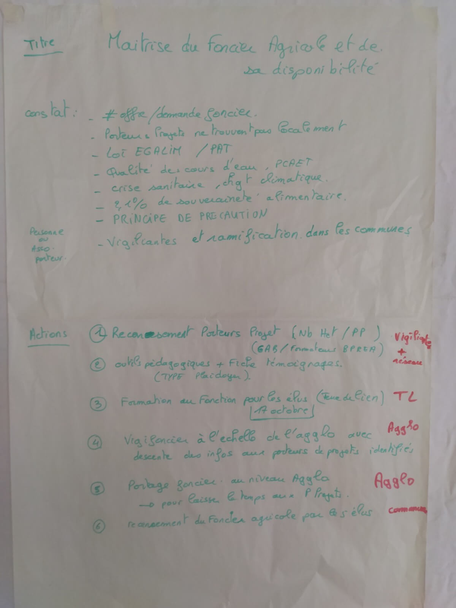

Compte-rendu du [week-end nourricier](https://www.vigiliantes.fr/events/20200911-week-end-nourricier/) du 11, 12, 13 juin 2020.

<!--more-->

**LIENS RAPIDES**
- [Conférence Les Greniers d'Abondance](#conférence-les-greniers-dabondance)
- [Journée de travail](#journée-de-travail)
  - [Les participants](#les-participants)
  - [Les 3 chantiers](#les-3-chantiers)
    - [1. Accès à une alimentation saine pour tous.tes](#1-accès-à-une-alimentation-saine-pour-toustes)
    - [2. Maîtrise du foncier par les élu.es, collectivité](#2-maîtrise-du-foncier-par-les-élues-collectivité)
    - [3. Organisation et Structuration de filières](#3-organisation-et-structuration-de-filières)
- [Table-ronde](#table-ronde)
  - [Les participants](#les-participants-1)
  - [Présentation des 3 chantiers](#présentation-des-3-chantiers)
  - [Retour des élus](#retour-des-élus)
  - [Echanges](#echanges)
  - [Conclusion](#conclusion)

__

## Conférence Les Greniers d'Abondance

La conférence des Greniers d'Abondance nous a invité à penser la résilience alimentaire sur deux volets qui se chevauchent :
- celui de la dégradation de fond du climat et des écosystèmes, progressif
- celui des situations de crise, ponctuelles et + brutales, qui seront de plus en plus fréquente.

Ces deux volets n'impliquent pas forcément la mise en oeuvre des mêmes solutions.

Parmi les actions à entreprendre :
- comprendre le système local. Comment fonctionne le système alimentaire, ici ? Cette connaissance n'existe pas vraiment. Les industriels n'ont pas à donner les infos sur la source de leurs produits, par exemple.
- partager de l'info sur ce qui est cédé etc. Pour l'instant, l'information est parcellaire,  dispatchée entre plusieurs interlocuteurs : chambre d'agriculture, terre de liens aussi, GAB locaux, civam, safer... Il manque une banque commune.

Extraits des réactions et questions du public :
- il est parfois difficile en tant qu'élu (notamment si on est réputé avoir une sensibilité écolo) de parler aux agriculteurs, qui se ferment car ils craignent l'"agri-bashing"
- les élus peuvent aussi avoir la crainte de se mettre à dos les agriculteurs, d'autant que l'agro-industrie est l'un des principaux pourvoyeurs d'emplois de la région
- s'il y a des agriculteurs dans les élus d'une ville, alors aucune info ne filtrera sur les terrains à céder car eux-mêmes cherchent à s'agrandir
- Comment se passe le déclic pour les collectivités ? On peut partir de la question de l'alimentation des enfants, pour aller vers plus de local et de bio. Parfois, c'est un élu convaincu et énergique qui porte les projets à bout de bras.

Vous pouvez [retrouver des conférences données pas les Greniers d'abondance sur leur site internet](https://resiliencealimentaire.org/conferences-sur-la-resilience-alimentaire/).

## Journée de travail

### Les participants

- Quentin, citoyen connaisseur de la construction de filières alimentaires,
- Hélène Rouxin, association Nature en vie », Brusvily,
- Philippe, Atelier « reprendre la main » et association « jardin des hérisson », 
- Mickaël, « jardin des hérissons et initiateur des incroyables comestibles à Lanvallay il y a quelques années
- Rémy, qui a porté un projet de Binée paysanne sur Dinan, cdd territoire zéro chômeurs)
- Camille, vigiliantes et Bretagne vivante, 
- Laëtitia, Sonia, Maria Bruyère, Claire, vigiliantes
- Françoise et Éric, arboricultrice, vente de plants sur Trébry
- Katia, association ESS'PRance, Pôle ESS
- Anaïs, Les Champs comestibles, arboricultrice, Corseul
- Patricia, projet d'installation
- Bruno, Fabrique citoyenne à Trébédan et responsable technique aux Jardins de Cocagne - Baptiste Bahuaud, maraîcher à Lanvallay
- Hélène, woofeuse chez Baptiste
- Élisabeth, présidente de l'ADAJ 22

### Les 3 chantiers

#### 1. Accès à une alimentation saine pour tous.tes

Réflexions autour d’un plan d’action pour une alimentation locale et de qualité pour tous.

**Les pistes de la précédente journée** : maison des semences et de l'alimentation, inventaires, catalogues des structures existantes, rencontres avec élus.es, éducation populaire et scolaires

**Constats** : 
- inégalité dans l'accès à une alimentation saine et sensibilisation pour l'alimentation
- intérêt à utiliser le mot alimentation sans adjectifs (bios, locales…)
- l'école est un lieu parfait pour initier ce projet, permet de toucher parents et enfants

**Pistes d’action / propositions** :
- « Ecole en action » : partir de l’éducation pour aller vers le citoyen, grâce à la création d’ateliers avec les élèves (sensibiliser par l’histoire d’un « produit moderne » (yaourt par exemple), ateliers jardins/ateliers semences/etc) et d’outils de ressources pédagogiques (voire pédagogie en direct). L’idée serait de finaliser ce travail auprès des élèves par un événement à la fin de l’année regroupant élèves et parents, durant lequel les enfants eux-mêmes animeraient des ateliers destinés à rendre compte aux parents de ce qu’ils ont appris au cours de l’année sur ce thème de l’ « alimentation pour tous ».
- sessions d'information, visite de jardins...

**Partenaires** : écoles, académies, APE, Coop scolaires, assos locales, centre sociaux, CDD et élus.es

#### 2. Maîtrise du foncier par les élu.es, collectivité

**Les pistes de la précédente journée** : Vigifoncier, outils pédagogiques pour élus, veille foncière citoyenne, identification des terres appartenant aux CCAS ou aux paroisses…

**Constats** :
- une inadéquation offre/demande (des fermes ne trouvent pas de repreneur, des porteurs de projets qui ne trouvent pas de terre)
- un cadre règlementaire qui exige des réponses (loi Egalim, PAT, PCAET)
- des chiffres de la souveraineté alimentaire très faibles au niveau national

**Ressource** : veille foncière citoyenne par les biais du collectif et des citoyens

**Pistes d’action / propositions** :
- recenser plus précisément les porteurs de projets (en développant notamment un partenariat avec les formateurs BPREA)
- développer des outils pédagogiques destinés aux élu.es avec des fiches témoignage (type plaidoyer) et des outils concrets (diagnostic d'opportunité foncière partagée, régie communal,…)
- recenser à l’échelle des communes le foncier agricole, et faire redescendre les infos aux porteurs de projet identifiés
- continuer l’action de plaidoyers, pouvant être portés par les citoyens lors des conseils municipaux
- importance de faire redescendre les informations quant aux notifications à la Safer
- réfléchir à des regroupements de porteurs de projets et voir comment pallier au fait qu’il faut pouvoir laisser du temps aux projets nourriciers de se mettre en place : portage foncier à l'échelle de l'agglomération
- Formations des élus.es sur le foncier avec Terre de Lien, organisée le 17 Octobre 2020 sur le territoire

#### 3. Organisation et Structuration de filières

**Les pistes de la précédente journée** : plateforme de mise en commun, confection de paniers, points de dépôts territoriaux, légumerie/ conserverie

**Info** : Les jardins de Cocagne peuvent centraliser des commandes, ils peuvent prendre des produits pour distribution

**Constats** :
- existence d’un micro-phénomène de concurrence entre maraîchers, dû à des activités de maraichage en hausse, avec les mêmes méthodes et canaux de vente
- manque de coordination de la filière de bout en bout, pour enclencher un vrai cercle vertueux (question notamment de faire rester sur le territoire de ce qui y est produit…)

**Analyses** :
- se servir de ce qui a marché, mais aussi identifier ce qui a échoué, en ce qui concerne les tentatives passées de structuration de filière 
- une organisation raisonnée passera par un recensement des producteurs sur le territoire

**Pistes d’action / propositions** :

1. Organisation de la filière
- projet de création d’une cartographie par les Vigiliantes et le pôle ESS, pour identifier les différentes composantes de la filière locale et recenser les besoins et opportunités
- Point sur les besoins en restauration collective et sur les autres débouchés
- Travail sur la formulation des appels d'offre pour les rendre plus accessibles aux producteurs locaux

2. Développement de projets collectifs
- soutenir et favoriser la mise en commun (exemple des Jardins de Cocagne) des activités, de main d’œuvre, de bouts de parcelles, de matériels, etc, pour prendre un certain « volume »
- organiser pour mieux coordonner les temps et lieux de ventes (point de dépôts territoriaux, magasins producteurs...)
- penser aux solutions en ce qui concerne la transformation de la production sur le territoire (conserverie, légumerie,…)

**Remarques** : 
- inadéquation entre la demande des collectivités et l'offre, il faut du volume pour la restauration collective, plutôt des légumiers que des maraîchers
- la demande en quantité (loi égalim) peut amener des conventionnels, pour atteindre ces nouveaux marchés, à produire de façon « plus propre ». Intérêt à inclure tout le monde (pas que les bio) pour tenter d'apaiser la tension entre agriculteurs.trices.

## Table-ronde

**Objectifs :**
- Présenter les 3 chantiers sur lesquels les associations et les Vigiliantes ont travaillé sur les journées de rencontres inter- structures nourricières des 24 Juin et 12 Septembre 2020
 - Avoir le retour des élus

**Déroulé :** 
- Présentation du collectif des Vigiliantes et des associations participantes aux deux journées de travail 
- Présentation des présents ce jour  
- Présentation des chantiers 
- Retour des élus
- Expression des participants
- Conclusion

### Les participants

**Famille Otor** : citoyens de la commune de St Cast qui s’investissent dans la vie locale autour de la pédagogie, l’appui des structures pour le maintien en bio et l’aide à la création de jardins partagés.

**Thierry P.** : citoyen de la commune de Dinan, ancien habitant de Rouen, où il s’est intéressé à nombre de projets développés, et notamment au système de monnaie locale, etc… expériences dont il souhaite témoigner.

**Nicolas** : citoyen de la commune de Matignon, jardinier, qui a aidé à la création du jardin partagé de St Cast. Il a notamment le projet d’un magasin dédié aux producteurs pour faciliter l’accès aux produits locaux.

**Delphine Robinault** : élue de la commune de Matignon, et conseillère communautaire à l’agglo (autour de la thématique de l’eau).

**Emmanuel Cibert** : élu de la commune de Plouër-sur-Rance, adjoint à l’environnement et à l’urbanisme. Il a l’objectif de développer des projets visant la préservation de la biodiversité sur l’espace public, le soutien d’une alimentation bio et locale à l’école. Il se questionne sur la problématique du foncier.

**Bruno** : citoyen de la commune de Dinan, était également présent lors de la journée de travail la veille. Il est encadrant technique des Amis du Jardin. Il est intéressé, entre autre, par des thématiques autour des modes de vie intelligents, le recensement des asso et personnes ressources pour adhérer à une « charte de bon sens », et la coopération entre producteurs.

**Laurence Le Du-Blayo** : élue de la commune de Dinan, adjointe à la transition écologique et cadre de vie, et conseillère communautaire à l’agglo. Elle coordonne entre autre la commission « transition écologique et aménagement », et est déléguée à la revitalisation du centre.

**Mathilde Pillot** : élue de la commune de Lanvallay (et vigiliante), en charge de la commission transition, et conseillère communautaire à l’agglo. Elle s’investit notamment sur le dossier concernant la récupération de 7ha de terrain appartenant à la mairie, anciennement fléché sur des projets urbains maintenant reclassés en terrain agricole. 

**Emmanuel** : citoyen de la commune de Taden, propriétaire d’une ferme et d’1ha de terrain agricole, où il réfléchit à mettre en place un projet agricole de bout en bout : « faire pousser, récolter, transformer, vendre » sur le même lieu. Il a un projet de micro-brasserie.

Ainsi que les membres des Vigiliantes : Laetitia, Claire, Sonia, Maria-Theresa, Béatrice, Yolène.

### Présentation des 3 chantiers

Voir le détail [des 3 chantiers](#les-3-chantiers) plus haut

### Retour des élus

**Plouër-sur-Rance, Emmanuel Cibert**

- les écoles sur Plouër représentent environ 600 repas. La commune vient de signer une convention avec la Vicomté. Ainsi, la cuisine centrale fournit en repas les écoles des communes de Plouër, Langrolay et la Vicomté. Ils sont en 50% bio et local, avec le projet d’en augmenter la proportion.
- en ce qui concerne l’éducation, l’élu fait remarquer que les enseignants ont eux-mêmes pas mal de contraintes à respecter, ce qui peut créer des difficultés à intégrer de nouveaux projets. Cependant, la municipalité développe un projet d’ « éco- école ».
- en terme de souveraineté alimentaire, le contexte sanitaire peut servir de levier pour développer un argumentaire de « principe de précaution » et  appuyer les projets allant dans ce sens. 
- au sujet des problématiques foncières : certaines communes, dont Plouër, voient le prix des parcelles flamber. L’acquisition de terrains devient alors compliquée pour développer de nouveaux projets nourriciers, et fait place au développement de projets « hors-nourriciers », qui grappillent peu à peu les terrains potentiels, et, par ailleurs, participent de manière systémique à la hausse des prix sur la commune.

**Dinan, Laurence Le Du-Blayo**

- au sujet des politiques soutenues par la commune : depuis 2009, Dinan a entamé un travail important pour recenser les producteurs, et a déjà pris pas mal d’engagements pour atteindre le 100% bio.
- il y a un projet de regroupement des deux cuisines centrales présentes sur la commune nouvelle en une seule.
- le volet de l’éducation et du lien avec les enseignants est à stimuler.
- au sujet de l’ouverture d’une « maison des semences », projet soutenu par le collectif, l’élue rappelle qu’il existe dans le programme un projet de création de « Maison des transitions » sur la commune, lieu qui pourrait faciliter ce genre de projet. Elle évoque aussi la question le l’implantation future de la Maison du Parc, inhérente à la création du PNR…
- vis à vis du foncier : l’outil vigifoncier semble apparemment compliqué, c’est ainsi que cela lui a été présenté, mais cela reste un point de départ.  La commune de Léhon-Dinan présente de nombreux potentiels, et de nombreux avantages facilement mobilisables (proximité avec l’habitat, proximité du marché de consommation, etc). Par ailleurs, l’utilisation de petites parcelles en jardins partagés est un axe prometteur de développement. Elle nourrit aussi le projet de développer un partenariat avec des groupes d’étudiants (par exemple le groupe de l’université de Caen) spécialisés dans le foncier et le transfert de foncier, afin d’amener des compétences sur le territoire.
- un alternant en licence pro « Aménagement et urbanisme », Christophe Sarasin, va commencer son stage à la mairie (positionné au service des espaces verts, mais travaillera en collaboration avec les autres services). Il aura pour objectif d’émettre une « fiche technique » d’un côté, rendant compte de l’emplacements des parcelles (cartographie) et leur aspects techniques (comme leur approvisionnement en eau, etc), et une « fiche acteur » de l’autre, axée sur l’utilisation faite de ces parcelles. L’élue attend que cela dégage les potentiels réels en foncier sur la commune. 
- par rapport à la structuration de filière : l’élu Maxime Sachet peut être une personne ressource, pour la question des achats, mais aussi le projet de plateforme de livraison, qui pourrait être investi comme « relais » des producteurs locaux.

**Lanvallay, Mathilde Pillot**

- sur la question de l’alimentation pour tous, il lui paraît essentiel d’intégrer les cuisiniers (des écoles notamment) comme partenaires à nos démarches. Idem par rapport aux centres de loisir, pour par exemple développer des ateliers cuisine.
- elle fait l’essai des outils pédagogiques des Incroyables Comestibles, dont elle nous formulera un retour
- sur la commune, beaucoup de projets sont en réflexion (ex : le compostage), pour créer des lieux ressource. Il se pose cela dit la question de la gestion de ces lieux (recrutement possible ?)
- elle met l’accent sur le besoin du travail conjoint et de la coordination pour faire tenir et structurer les projets à venir, afin que ceux-ci ne tombent pas à l’eau, et soient portés par plusieurs parties : les associations, les citoyens et la mairie.
- il y a un projet d’achat de terres par la commune et d’installation de porteurs de projets choisis par eux (pour contrôler ce qui se passe dans leur commune dans l’idée de préserver l’intérêt général). Il se pose la question des aspects techniques de la régie municipale.
- sur la question du foncier : elle constate qu’il y aurait sûrement besoin d’un poste dédié au vigifoncier et la mise en lien rapide avec des porteurs de projets, et que l’on a besoin des communes sur ce point.
- le marché sur Lanvallay n’est pas concluant. Il y a donc des attentes afin de restructurer les choses sur ce point.
- l’élue rappelle qu’elle a interpelé l’agglo sur des sujets qui lui paraissent essentiels, comme développer un projet de conserverie, utiliser des espaces commerciaux disponibles autour de projets moteurs et vertueux pour l’autonomie alimentaire du territoire, mettre en place comme à Rennes un label qualité qui met en commun les pratiques agricoles et la qualité de l’eau, développer des partenariats avec les centres commerciaux afin qu’ils deviennent acteurs dans la distributions de produits locaux, …

**Matignon, Delphine Robinault**

- elle partage l’avis que les cuisiniers des collectivités sont des partenaires centraux à intégrer absolument dans nos démarches, car c’est eux qui choisissent leurs produits
- sur sa commune, les épiceries et supermarchés soutiennent déjà les producteurs locaux 
- le marché fonctionne bien et valorise les producteurs locaux (halles).
- un magasin de producteurs est en projet.
- sur la question des écoles, elle suggère qu’il est important de laisser une marge de manœuvre aux enseignants et d’éviter d’arriver avec un projet clé en main. 

### Echanges

(Béatrice) 
- Existence à Dinan d’un disposif « Energie en action » » : parallèle avec « école en action ». Est ce que cela pourrait intéresser les Vigiliantes ?
- D’autre part, il existe des initiatives de producteurs (exemple à Quévert) afin de centraliser la distribution. Idem à Créhen : création d’une SCIC de producteurs… Du coup cela met l’accent sur l’importance de pouvoir tout coordonner !
- Question de l’investissement de citoyens, pour créer ainsi un « circuit court de l’argent », avec une épargne locale et fléchage systématiques des investissements pour financer des projets locaux et vertueux. Pour se faire, pouvons-nous créer un fond d’investissement ?  

(Thierry)
- Pistes de réponses sur ces point à Rouen, notamment par le biais du développement d’une monnaie locale, qui apporte aussi des solutions de placements

(Emmanuel C)
- Rappelle qu’il existe des projets participatifs sur les modèles énergétiques. Est ce qu’il ne serait pas possible de s’en inspirer ?

(Bruno)
- Autre exemple inspirant : il existe une coopérative de citoyens en Belgique qui achète des parcelles de forêt.
(Thierry)
- Est ce qu’il existe un moyen de repérage des ressources de la finance citoyenne sur le territoire ?

(Laetitia)
- Lancer ce genre de projet par le biais des vigiliantes est un sujet qui lui tient beaucoup à cœur, notamment à travers l’acquisition collective de terres (exemple le réseau Optimisme à Lorient) 

(Emmanuel)
- Dispositif les Cigales : club d’investisseurs citoyens

(Nicolas)
- Question qui se pose notamment à Matignon : où permettre l’habitat de producteurs qu’on pourrait potentiellement installer sur la commune ? Si on ne peut loger un producteur sur place, cela crée un frein inévitable à l’installation. 

(Emmanuel C)
- Problème posé aussi par la loi littoral : certaines jurisprudences créent des difficultés pour répondre à ces questions… Du coup, cela ajoute de la pression foncière, et encore une fois il est plus facile pour les « gros » producteurs de s’installer que pour les « petits ».

(Mathilde)
- Rappelle sur ce point qu’il y a un retoquage de l’agglo, qui était en défaut quant à son PLUIH, et que Lanvallay va recevoir une association Hameau léger.

(Emmanuel C)
- Question du cadre réglementaire qui empêche certains projets

(Nicolas)
- Par ailleurs, il y a aussi besoin d’une éducation du consommateur, notamment sur la saisonnalité des produits, ce qui pourrait à terme limiter la pression jouée par le consommateur sur les commerçants, qui veulent répondre aux demandes.
- Rappelle la capacité que les particuliers ont à produire du légume (limite à 500m2, car si la surface est supérieure, il faut déclarer et choisir un statut)

(Elisabeth Lechenne) – qui est arrivée en cours de discussion
- présentation : juriste à la chambre de l’agriculture des Côtes d’Armor et présidente de l’Adaj (Association départementales des auberges de jeunesse). 
- réflexion autour du devenir de l’auberge de jeunesse de Dinan : appartenant à l’association départementale, l’auberge ne sera pas abandonnée, et ils espèrent dédier le bâtiment au soutien de tout projet sur une thématique environnementale, et en ce sens, elle assure que le collectif des vigiliantes a sa place sur ce lieu.

(Laurence)
- (à Elisabeth) réflexion au sujet de la continuité des réseaux piétonnier et cyclable sécurisés sur Dinan, incluant un itinéraire jusqu’à l’auberge.
-sur la question de l’habitat des producteurs : attention à ne pas faire reculer les avancées qui ont pu être permises par la loi littotal, et ne pas permettre une urbanisation de ces espaces, avec notamment le risque de la pérennisation des habitats légers, qui du coup ne sont plus « légers ». N’y a-t-il pas là un risque d’urbanisation mal encadrée ? Elle évoque la complexité du sujet, et l’importance de le prendre en compte sur le long terme (question de repreneurs par exemple)… Attention de ne pas repartir sur une dynamique de grignotage des terres et de mitages.

(Emmanuel) 
- Exemple de Montauban en 2003 : la municipalité a investi et créé un programme d’activité agricole et habitat (habitat collectif) sous forme de « part », qui du coup donnait un droit de logement au maraicher.

(Thierry)
- a expérimenté un « éco-village »
- selon lui, il y a un problème, et donc une réflexion à avoir, car beaucoup de projets très créatifs ne peuvent advenir car il n’existe aucune aide pour ces porteurs de nouveaux projets. Il se pose la question quant au droit rural sur l’habitat léger (peu cher).

(Mathilde)
- rappelle que le revenu  d’un maraicher excède rarement les 1000€, et que cela ajoute de fait une complexité sur la question du logement dans ces professions

(Laetitia)
- Question de la légalité des habitats réversibles. Exemple des cahutes, qui sont présentes sur le littoral.
- Au sujet de la démarche sur la qualité de l’eau et les activités agricoles, un travail est entrepris entre Terre de liens et Rance-Frémur.

(Laurence)
- Au sujet de l’habitat : il lui semble qu’il y a un mélange des genres entre différents sujets évoqués jusqu’ici entre habitats réversibles, habitats légers (au sens peu coûteux) et la mise en constructibilité pour raison agricole de terrains « protégés ». Il faut les différencier pour avancer sur cette question.

### Conclusion

Des canaux de communication se créent et c’est très positif. 
Les élus, ainsi que les citoyens sont vivement remerciés pour le temps qu’ils nous ont consacré (un dimanche !)
Nous avons tissé du lien, et la suite dépend de nous.
