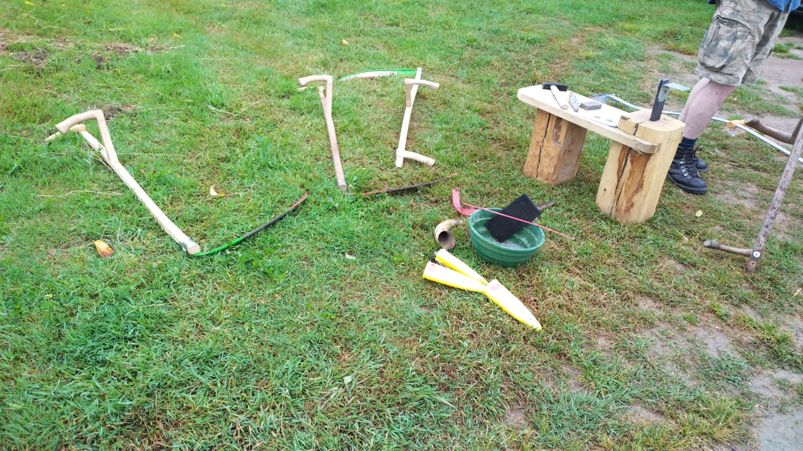
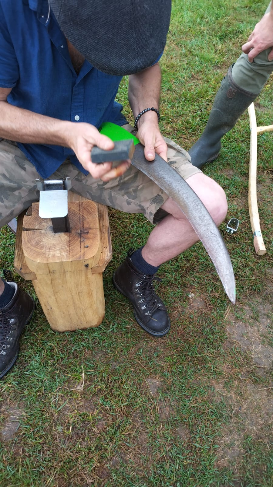
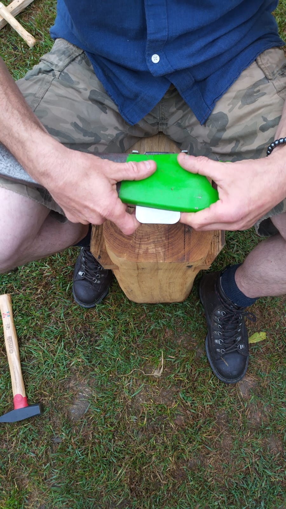
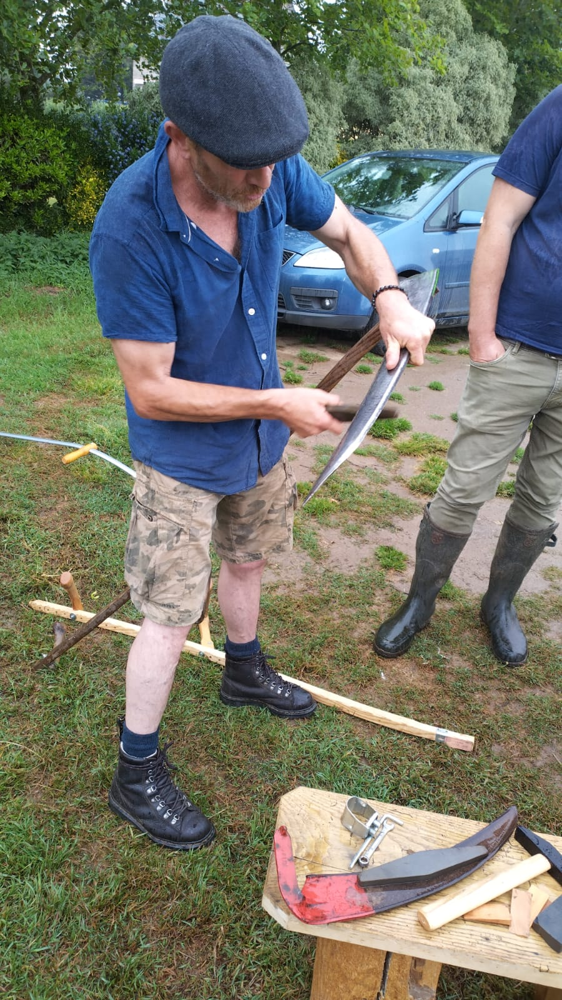

Même sous les averses de bruines, on peut parler fauchage !
Samedi 10 juin avait lieu notre première initiation au fauchage à la faux, avec Mikaël du Jardin des Hérissons.

Un atelier hyper riche, où on a parlé de :
- le pouvoir méditatif du fauchage au point du jour
- la différence entre faux et fauchon, quand utilisé l'une ou l'autre
- gomme abrasive, marteau, enclume, pierre à aiguiser... ou l'art d'entretenir sa faux
- et puis essai de fauche sur la parcelle !

<!--more-->

On a été tellement convaicue (et y'a tellement de quoi faucher chez nous) qu'on essaye de lancer une **commande de groupée** au [Comptoir de la faux](https://comptoirdelafaux.fr/). Contactez-nous si ça vous intéresse !

Pour les personnes qui veulent approfondir, sachez que Mikaël propose aussi des **formations plus poussées**, en tout petit comité, pour notamment apprendre à régler, entretenir, manipuler son propre outil. Pour plus d'infos : [email](mailto:jardindesherissons@gmail.com)

Quelques photos :

*L'ensemble des outils présentés*

*Utilisation de la gomme abrasive*

*Positionnement pour marteler la faux sur l'enclume (toutes les 3 à 5 heures de fauche)*

*L'aiguisage de la faux (régulièrement durant la faux)*

