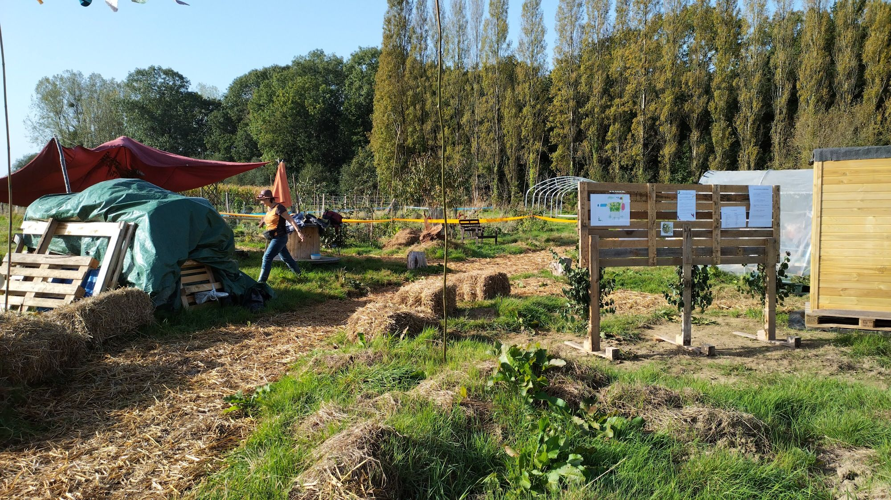
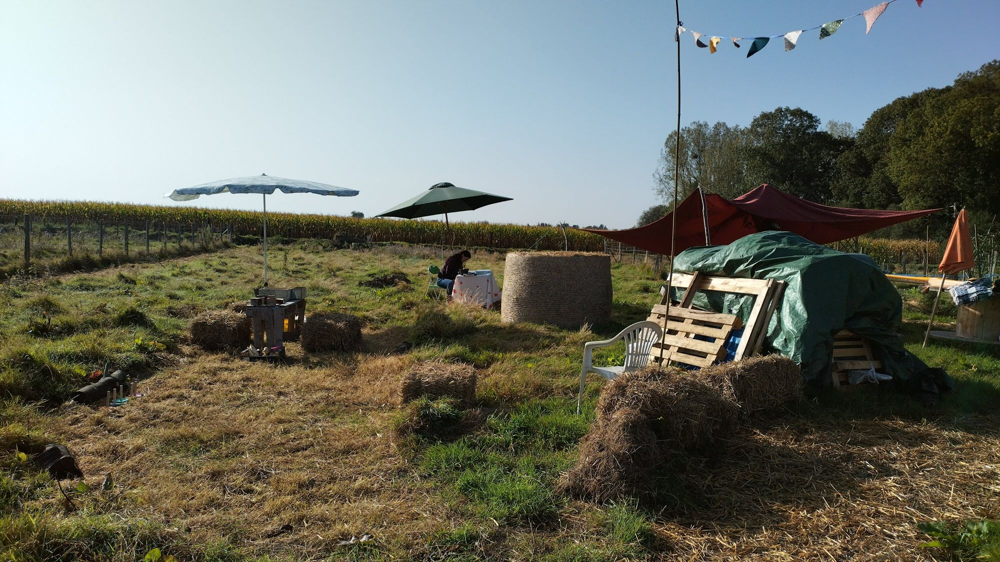
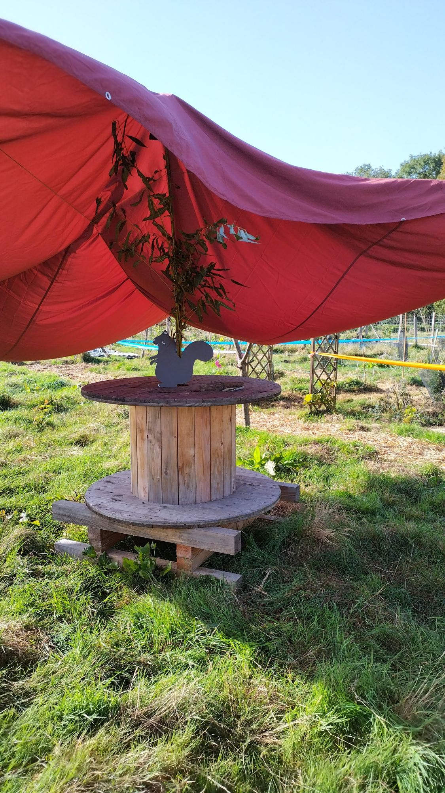
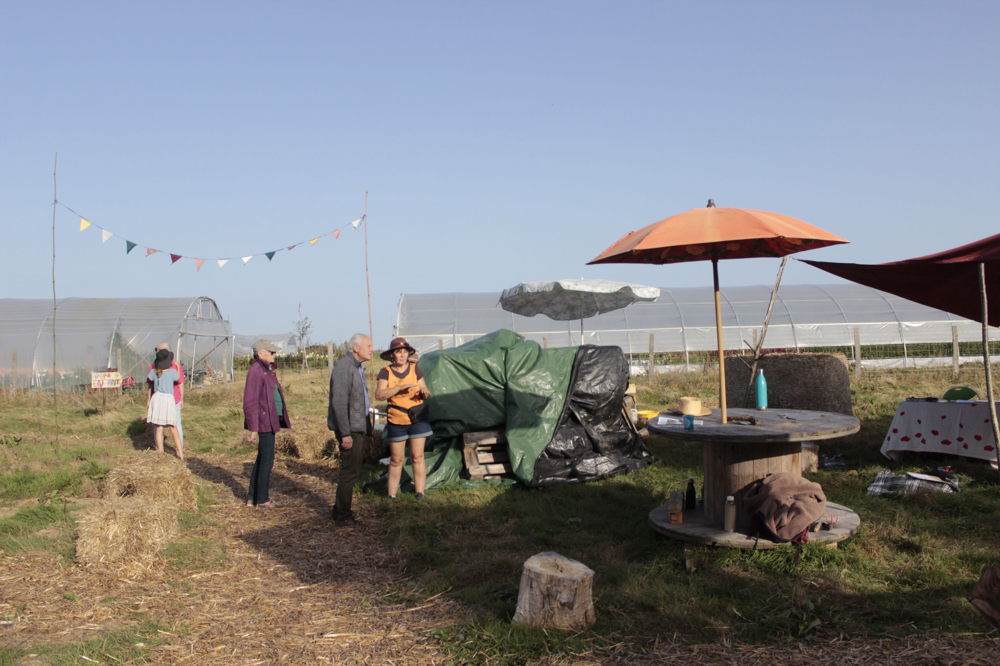
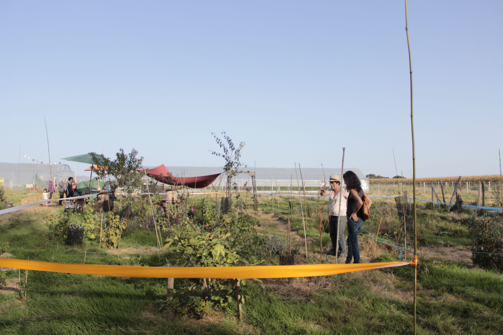

Quelles furent douces, ces portes ouvertes sous un soleil éclatant tout à fait anormal pour un début octobre !

Des curieux et curieuses du coin, des connaissances d'un peu plus loin, de l'intérêt, de la bonne humeur...

On a été ravi de vous croiser à la buvette et de vous faire visiter notre terrain de jeu !

On espère que ça vous a plu autant qu'on a pris plaisir à vous accueillir.

Avec un peu de chance, ce ne sera pas la dernière !

<!--more-->

Quelques photos et vidéos :

<video width="480" height="864" controls>
  <source src="portes_ouvertes_ti_rouffs.mp4" type="video/mp4">
</video>

<section class="splide" aria-label="Diaporama initiation bouture">
  

		<ul class="splide__list">
			<li class="splide__slide">
        
        

					Vue d'ensemble, dans l'attente des premières visites
				

      </li>
			<li class="splide__slide">
        
        

					Vue d'ensemble, dans l'attente des premières visites
				

      </li>
			<li class="splide__slide">
        
        

					L'écureuil d'accueil, sous la toile tendue
				

      </li>
			<li class="splide__slide">
        
        

					Une visite de la Pépille en petit comité (photo Juliana Hillman)
				

      </li>
			<li class="splide__slide">
        
        

					Autre aperçu de visites de la Pépille (photo Juliana Hillman)
				

      </li>
		</ul>
  

</section>

