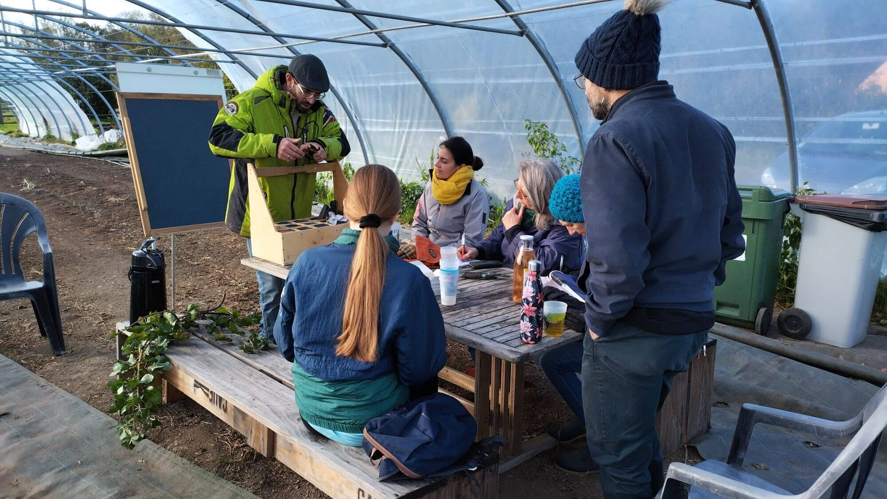
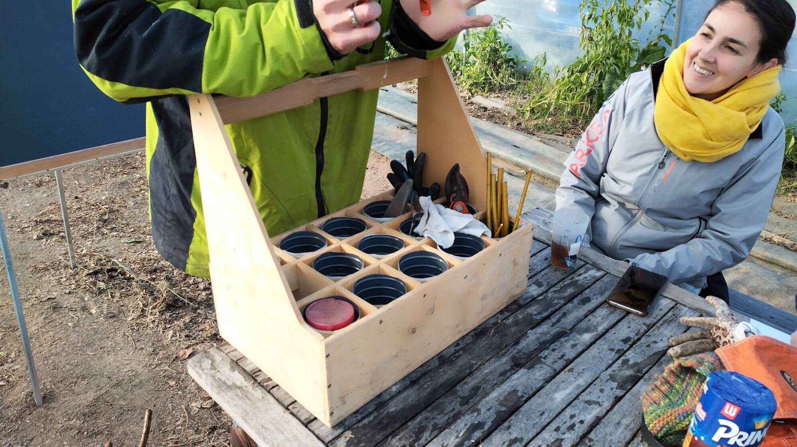
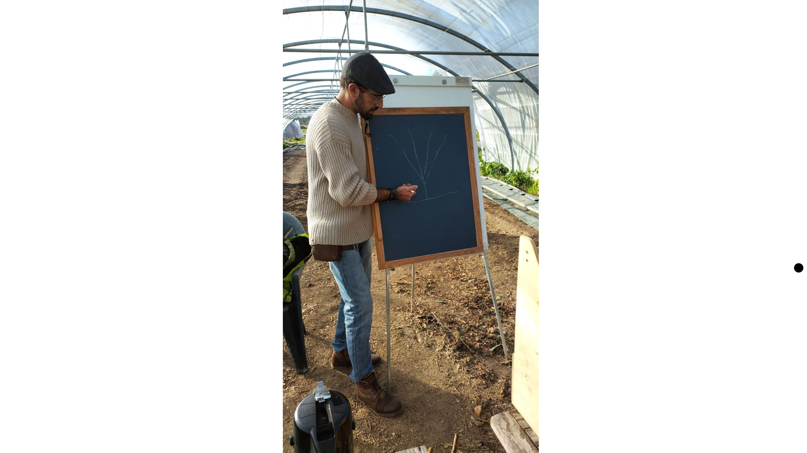
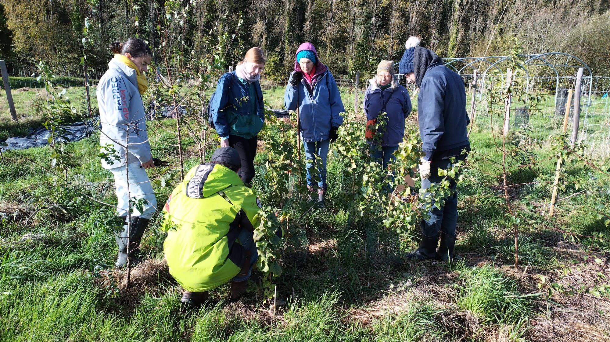
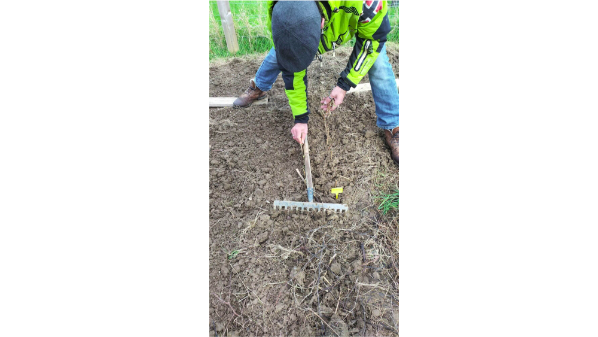
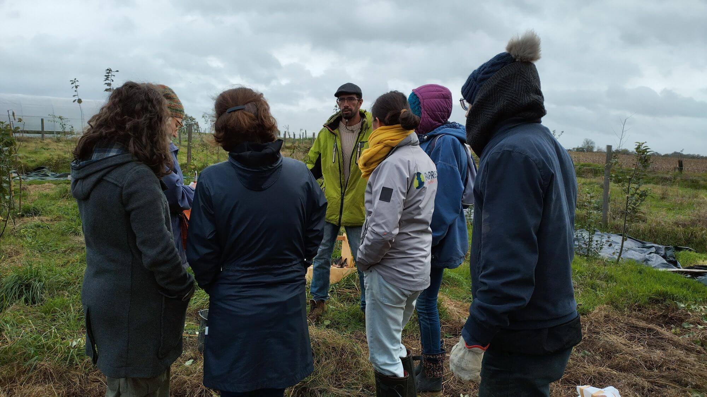
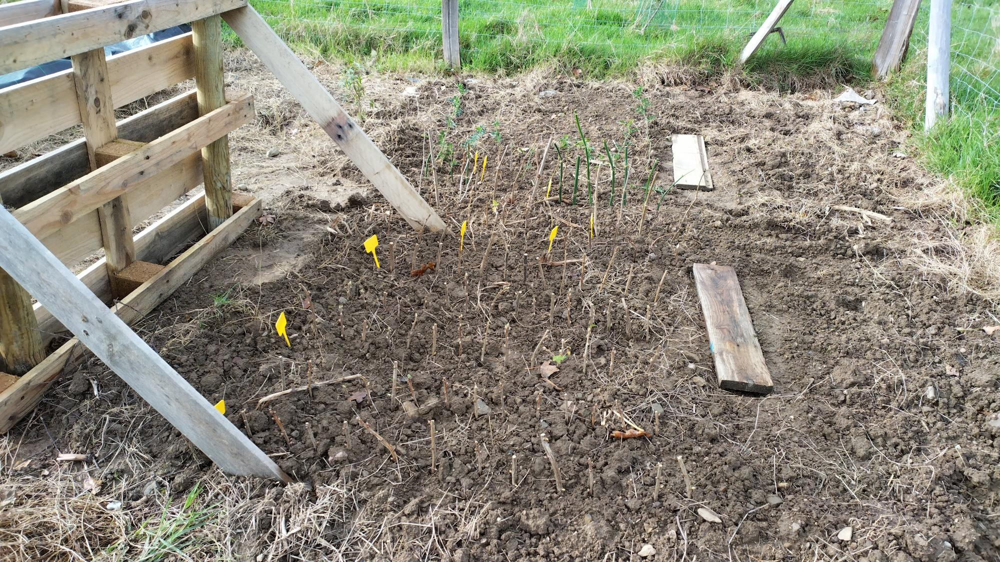
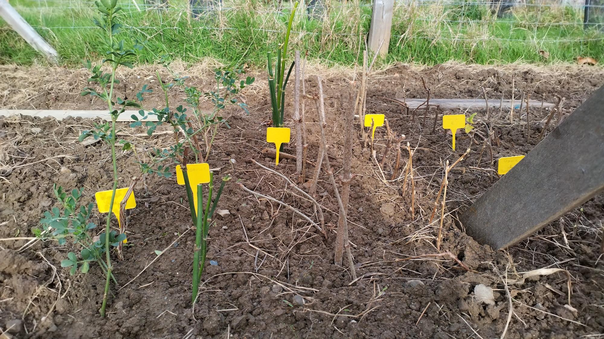

Samedi 4 novembre à la Pépille, nous avons accueilli Benjamin de l'Aronde - un éco-lieu très chouette qui se trouve à Languédias - pour un atelier consacré au bouturage. Benjamin est un connaisseur, il pratique la bouture depuis huit ans déjà. Notamment au sein de l'association Incroyables comestibles, avec laquelle lui et sa compagne ont créé des jardins partagés dans la commune de Pleurtuit, où le couple vivait à l'époque. Il poursuit ses expérimentations dans sa nouvelle maison et parvient à vivre en autonomie avec sa famille une bonne partie de l'année.

L'occasion était donc toute trouvée pour aborder les différentes techniques de multiplication végétative, que ce soit la division des mottes, bien pratique pour des artichauts, de la consoude ou de la rhubarbe par exemple. Mais aussi les boutures racinaires, faciles à mettre en œuvre sur des framboisiers, ou encore le marcottage aérien ou non, qui fonctionne avec de nombreux fruitiers tels le poirier, le prunier, le mirabellier.

Une fois la présentation terminée, les participantes et participants à l'atelier ont pu s'essayer à la bouture ligneuse avec des pieds de cassissiers et de groseillers (on a même tenté des boutures un peu plus exotiques à base de sureau, de coronille ou d'arbre à faisan). Toujours avec les bons conseils de Benjamin. Nous espérons que nos essais porteront leurs fruits !

<!--more-->

Quelques photos :

<section class="splide" aria-label="Diaporama initiation bouture">
  

		<ul class="splide__list">
			<li class="splide__slide">
        
      </li>
			<li class="splide__slide">
        
      </li>
			<li class="splide__slide">
        
      </li>
			<li class="splide__slide">
        
      </li>
			<li class="splide__slide">
        
      </li>
			<li class="splide__slide">
        
      </li>
			<li class="splide__slide">
        
      </li>
			<li class="splide__slide">
        
      </li>
			<li class="splide__slide">
        
      </li>
		</ul>
  

</section>

