2023, c'était notre deuxième année à la Pépille, pépinière associative et forêt nourricière, et la 4e ou 5e année d'existence des Vigiliantes. C'est l'heure de l'exercice revigorant de la rétrospective annuelle, pour se rendre compte du chemin parcouru !

<!--more-->

## 1. A la Pépille

### Création de la pépinière, notre espace de production

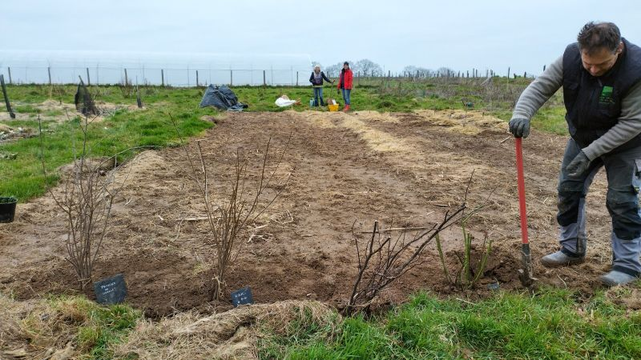


L'une des grandes nouveautés est la création d'une pépinière en bonne et due forme : un espace clôturé de production d'arbres et arbustes, destinés à vivre leur vie ailleurs ensuite.

Merci à toutes les personnes qui se sont fait les bras avec nous à coups d'enfonce piquet !

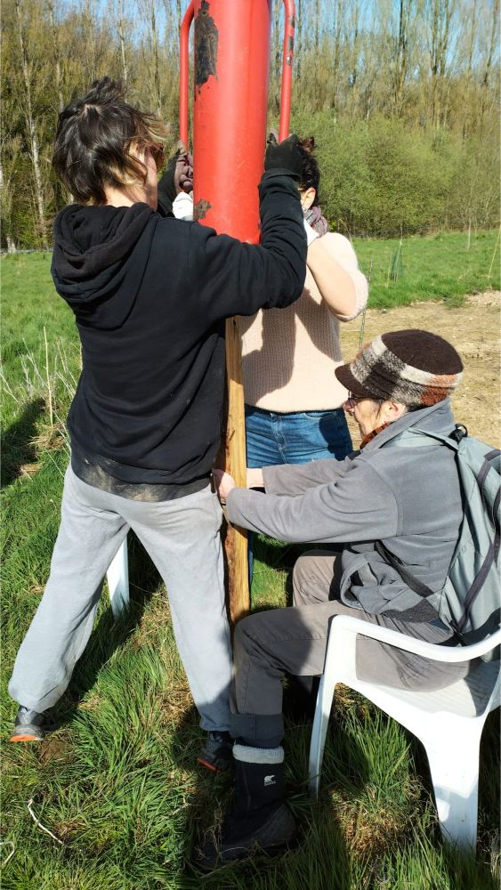


Grâce à cet espace, on a pu greffé une trentaine d'arbre et bouturer une trentaine de petits fruitiers. 2Bilan des courses : + de la moitié des greffes ont pris (comme on est des débutantes complètes, on trouve ça pas si mal), une vingtaine de boutures de petits fruits et 4 ou 5 figuiers. 

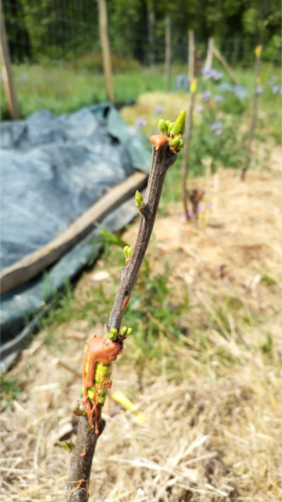


**Toutes ces plantes vont chercher un nouveau site d'implantation en 2024 !** Avis aux jardins collectifs, aux zones artisanales ou aux collectivités...

### On commence sérieusement les aménagements

En 2022, la Pépille a été lauréate du 1er budget participatif de Dinan Agglomération. C'est grâce à cette aide qu'on a pu donner un coup de collier sur l'aménagement du lieu en 2023.

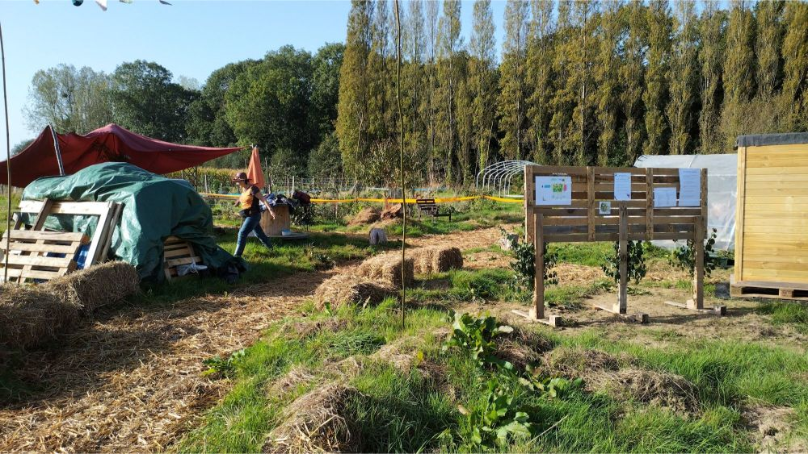


En plus d'un espace pépinière clôturée, on a ainsi vu émerger : 
- des **toilettes** sèches,
- une **mare** (qui sera finalisée en ce début d'année),


- des **cheminements** mieux dessinés (grâce à l'"effet pelleteuse" : quand on s'initie à la pelleteuse, on ne veut plus s'arrêter et on se trouve de nouveaux chantiers non prévus...),
- un **tunnel maraîcher** en cours de montage (c'est long, dites donc)
- une grosse pile de matériaux pour construire un **cabanon de stockage** (avis aux amateurs et amatrices de lego, y'a du boulot !)

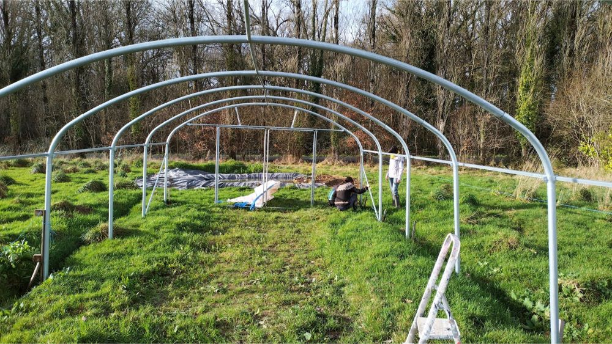


### On initie de nouveaux formats

A côté des traditionnels chantiers ouverts et des ateliers (plus d'infos un tout petit peu plus bas), on a aussi lancé de nouveaux formats de rencontre.

Tout l'été, des **apéros-chantier** (on avance ensemble sur une tâche précise, puis on boit un coup) ont permis à celles et ceux qui ne sont pas disponibles en journée de venir nous rendre visite en soirée.

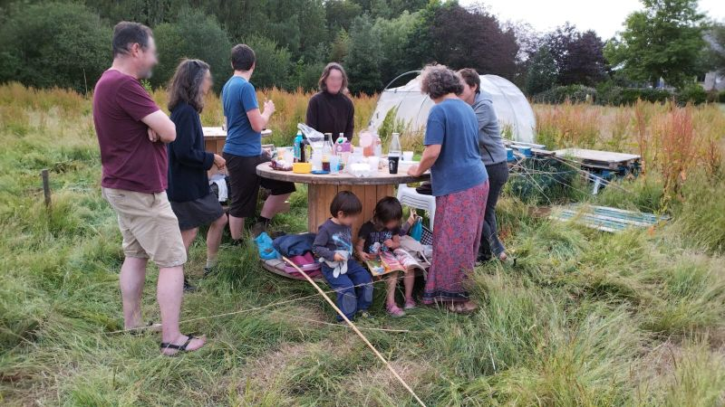


Et en fin d'année, on est ravie d'avoir accueilli **une première classe** sur la Pépille, le temps d'un après-midi ! Fin novembre, une classe de CP de l'école de Lanvallay a pu découvrir le lieu et mettre en terre des boutures de groseille, cassis et thym. 

Rendez-vous au printemps pour voir ce qui aura pris !

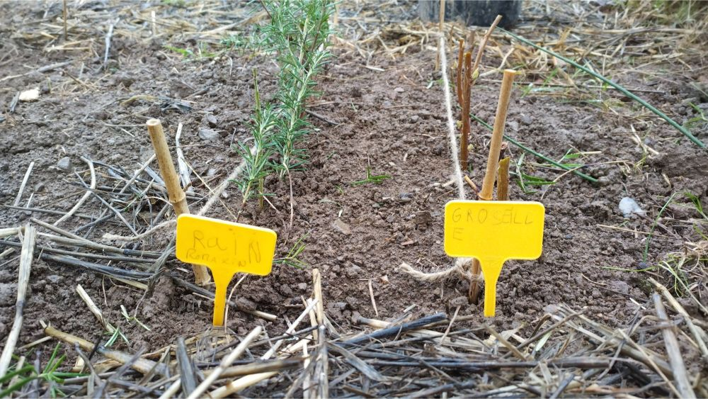


### Les temps forts

- Février : Initiation greffe anglaise

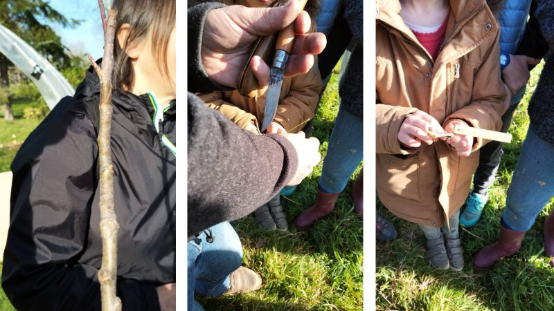


- Mai : Initiation greffe en couronne

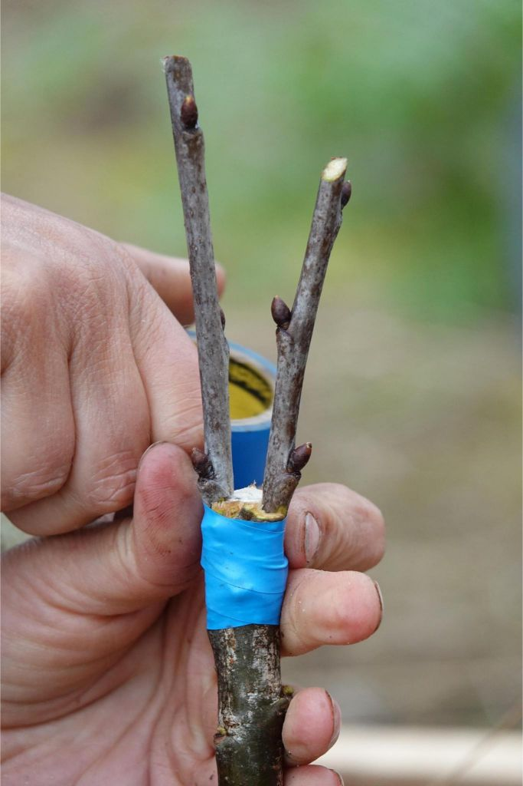


- Juin : Assemblée générale



- Juin : Initiation Fauchage

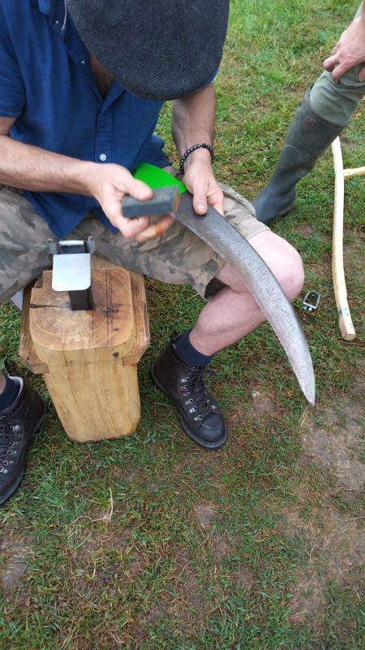


- Octobre : portes ouvertes

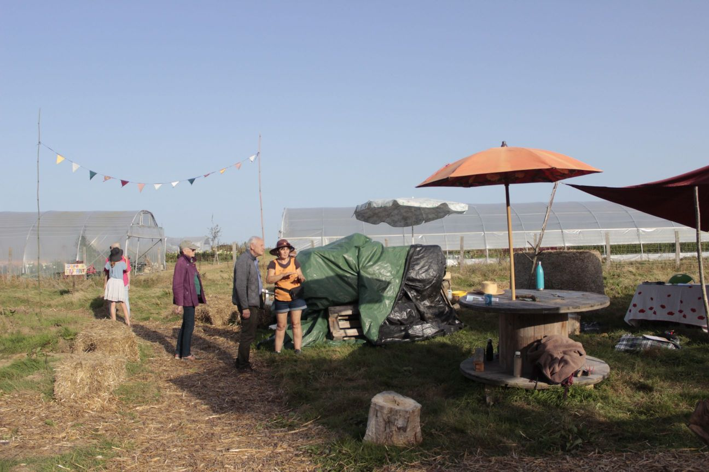


- Novembre : Initiation bouture

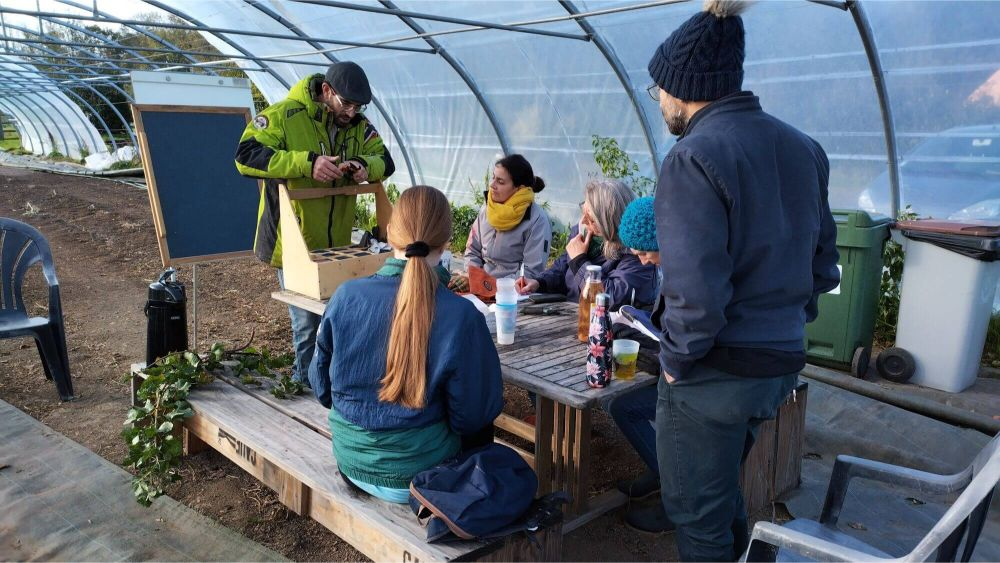


## 2. Les à côtés

Il n'y a pas que la Pépille dans la vie des Vigiliantes (même si c'est vrai que ça prend le plus gros de notre temps en ce moment...).

Alors, qu'a-t-on fait quand on n'était pas sur la parcelle ? 

- Février : organisation d'une fresque du climat au -feu- bar Kenvad
- Mars : Visite de la pépinière les Jardins de Beauchêne
- Août : Commande groupée de faux
- Novembre : Intervention durant la Semaine du Développement Durable du lycée Fontaine des Eaux, autour de l'atelier "Inventons nos vie bas carbone"
- participation à bon nombre de temps de réflexions, notamment auprès de Dinan Agglomération : ateliers SCOT, atelier Rupture Alimentaire, retour du programme de recherche Atlass 2...

## Quelques chiffres

2023, c'est : 

- une cinquantaine d'événements organisés (chantiers ouverts, initiation, visites, portes ouvertes...)
- environ 450 "entrées" en cumulé
- une soixantaine de greffes
- une centaine de plantations...

Durant cette année, on n'a pas avancé seuls, mais aidé par une multitude de personnes. Des asso, des collectifs, des particuliers... Un **immense merci** à toutes celles et ceux qui sont passés à la Pépille !

**Rendez-vous dès maintenant pour faire vivre ensemble l'année 2024 !**


<section class="splide" aria-label="Diaporama initiation bouture">
  

    <ul class="splide__list">
      <li class="splide__slide">
        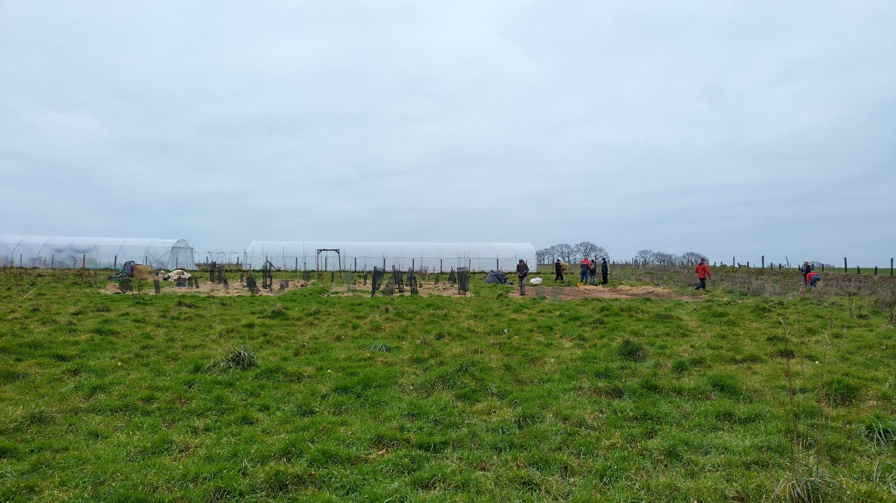
      </li>
      <li class="splide__slide">
        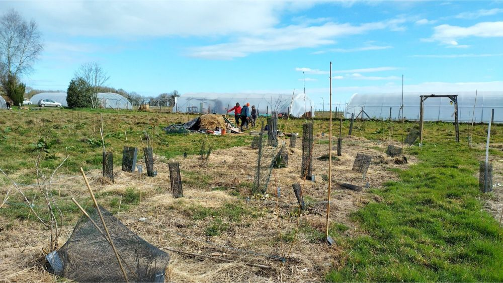
      </li>
      <li class="splide__slide">
        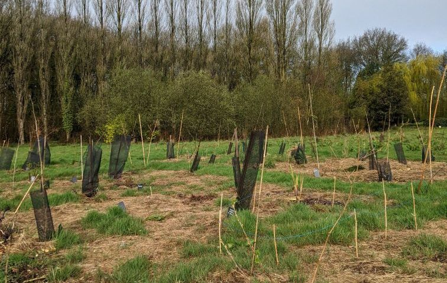
      </li>
      <li class="splide__slide">
        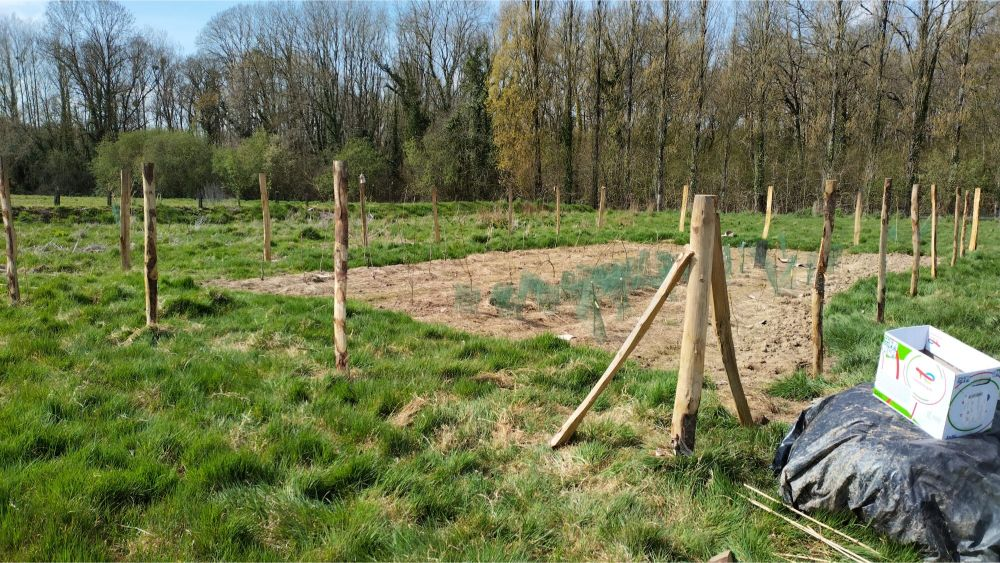
      </li>
      <li class="splide__slide">
        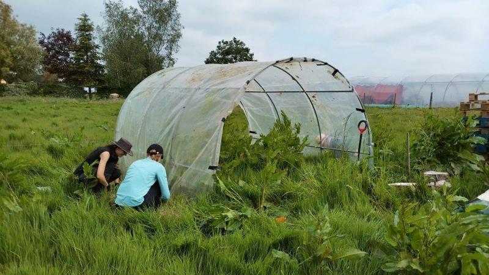
      </li>
      <li class="splide__slide">
        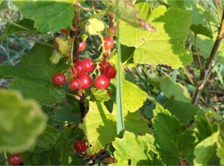
      </li>
      <li class="splide__slide">
        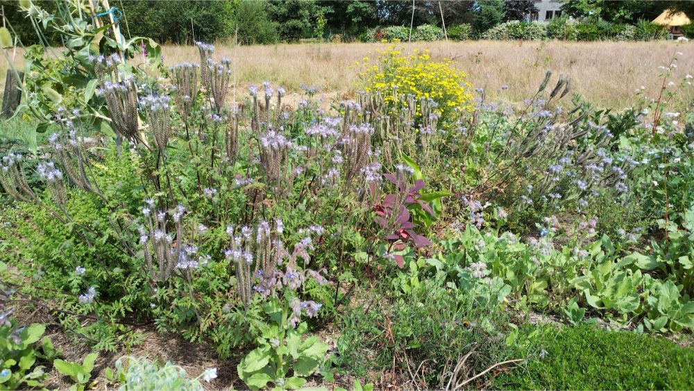
      </li>
      <li class="splide__slide">
        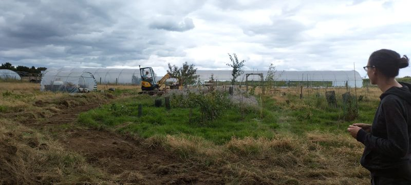
      </li>
      <li class="splide__slide">
        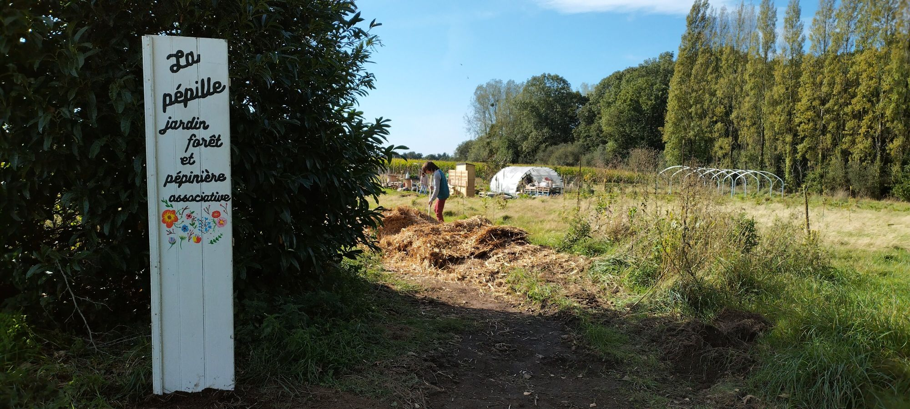
      </li>
      <li class="splide__slide">
        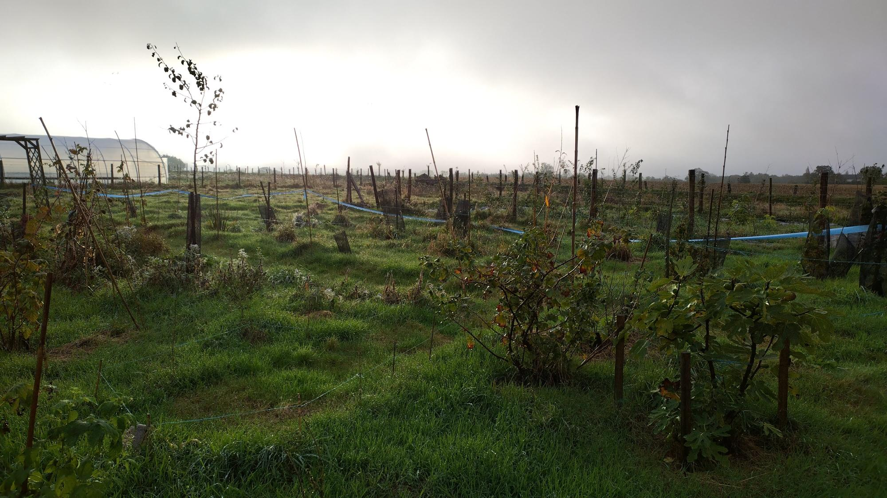
      </li>
      <li class="splide__slide">
        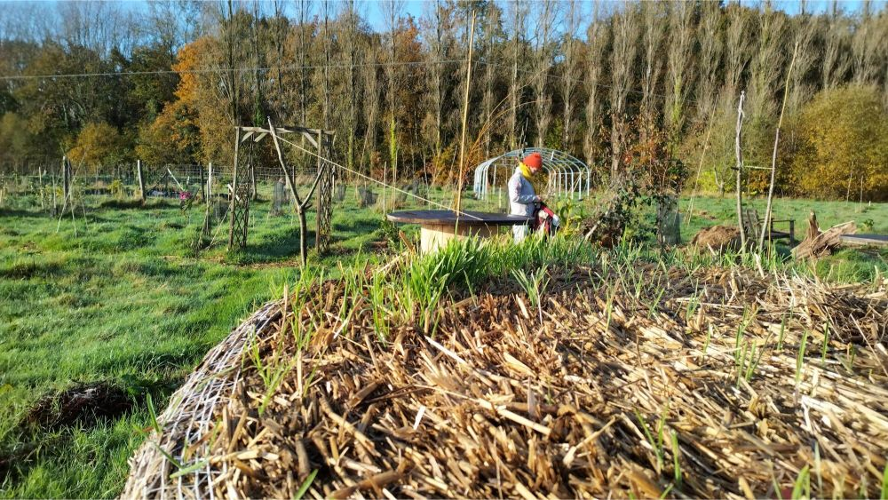
      </li>
      <li class="splide__slide">
        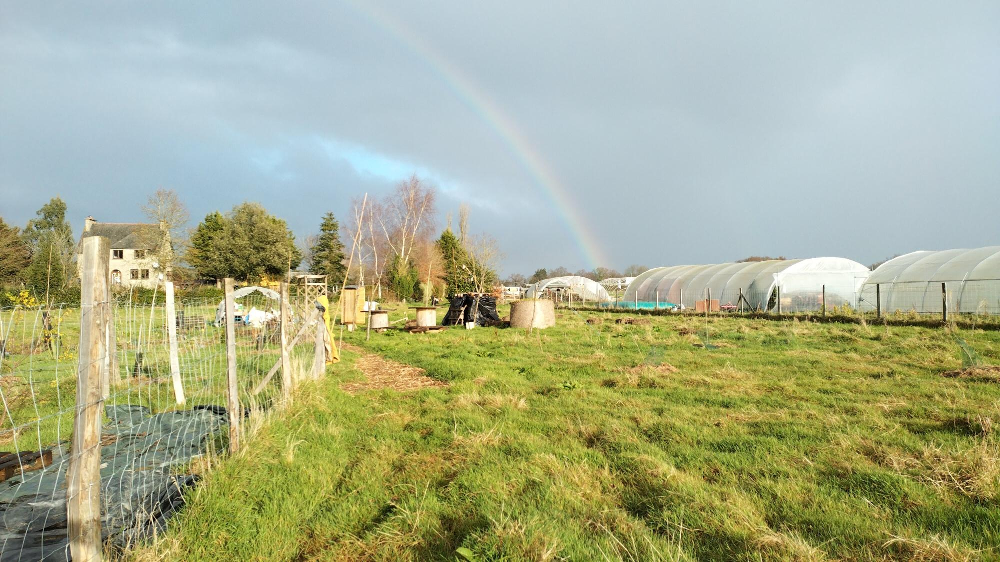
      </li>
    </ul>
  

</section>




